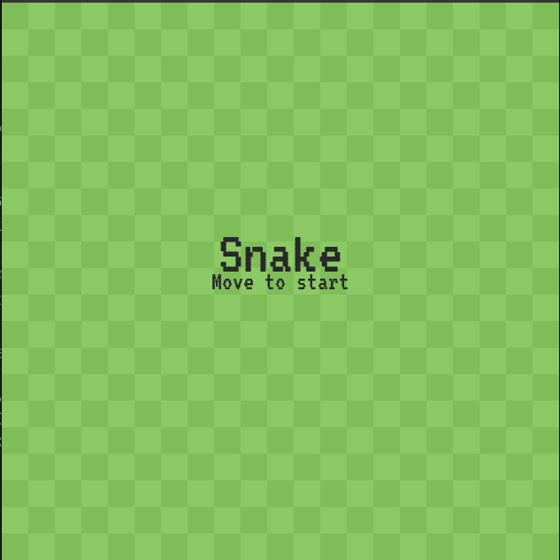
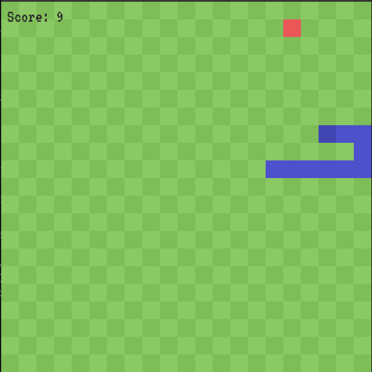
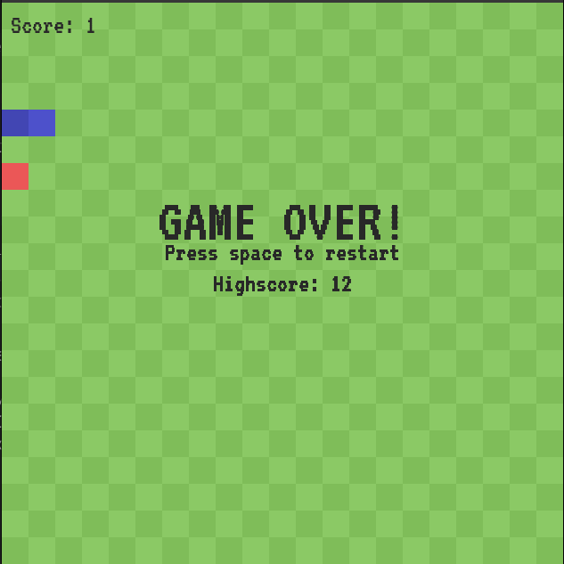

# Snake using Pygame

## Introduction
This is an arcade style snake game, written in python using pygame. The snake is implemented using a linked list.

## Running the app
- Clone or download this github repository
- Install requirements
- Run

`$ git clone git@github.com:AzracStudios/snake_pygame.git`

`$ cd snake_pygame`

`$ pip install -r requirements.txt`

`$ python3 main.py`

Note: The commands might vary slightly based on the platform.

## Resources
Pygame Documentation: https://www.pygame.org/docs/

Linked Lists: https://en.wikipedia.org/wiki/Linked_list#:~:text=In%20computer%20science%2C%20a%20linked,which%20together%20represent%20a%20sequence.

